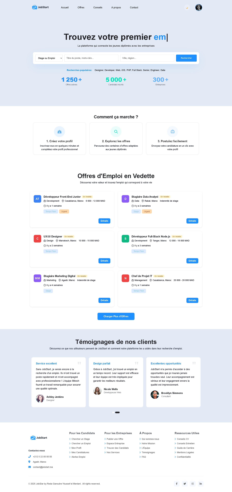
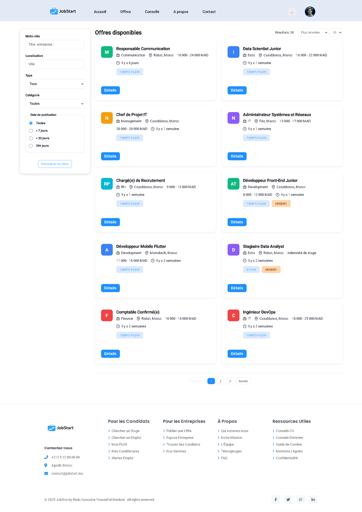
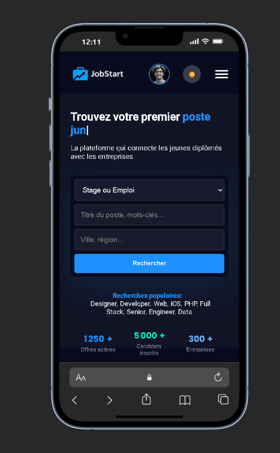

# 🚀 JobStart

[](https://opensource.org/licenses/MIT)
[](http://makeapullrequest.com)

> A modern, lightweight job board platform built with vanilla JavaScript, HTML, and CSS. No frameworks, no dependencies—just clean, efficient code.

## 📷 Screenshot





---

## 📖 Table of Contents

- [Overview](#overview)
- [Features](#features)
- [Demo](#demo)
- [Getting Started](#getting-started)
- [Project Structure](#project-structure)
- [Usage](#usage)
- [Configuration](#configuration)
- [Contributing](#contributing)
- [Roadmap](#roadmap)
- [License](#license)
- [Contact](#contact)

## 🎯 Overview

JobStart is a fully static job board application designed for simplicity and performance. Built without any frameworks or build tools, it provides a complete job listing platform that can be deployed anywhere—from GitHub Pages to any static hosting service.

Perfect for:

- 🎓 Learning web development fundamentals
- 🚀 Quick prototyping of job board concepts
- 📦 Deployment-ready static sites
- 🔧 Customization and extension

## ✨ Features

### Core Functionality

- 📋 **Job Listings**: Browse available job opportunities with filtering and search
- 🔍 **Detailed Views**: View comprehensive job descriptions and requirements
- 👤 **User Forms**: Separate forms for candidates and recruiters
- 📱 **Responsive Design**: Mobile-first approach for all device sizes

### User Experience

- 🌓 **Dark Mode**: Toggle between light and dark themes
- ⚡ **Fast Loading**: Optimized assets and minimal dependencies
- 🎨 **Modern UI**: Clean, professional interface design
- 🔄 **Client-Side Routing**: Smooth navigation without page reloads

### Technical Features

- 📊 **JSON Data Store**: Easy-to-edit job offers database
- 🎯 **Vanilla JavaScript**: No framework lock-in
- 🧩 **Modular Architecture**: Well-organized, maintainable code
- 🔧 **Zero Build Process**: Deploy directly without compilation

## 🎬 Demo

```bash
# Quick start - no installation required!
python -m http.server 8000
```

Then open [http://localhost:8000](http://localhost:8000) in your browser.

## 🚀 Getting Started

### Prerequisites

- A modern web browser (Chrome, Firefox, Safari, Edge)
- Optional: Python 3.x or Node.js for local development server

### Installation

1. **Clone the repository**

   ```bash
   git clone https://github.com/Reda-Ganoutre01/JobStart.git
   cd JobStart
   ```

2. **Choose your preferred method to run:**

   **Option A: Direct File Access**

   ```bash
   # Simply open index.html in your browser
   open index.html  # macOS
   start index.html # Windows
   xdg-open index.html # Linux
   ```

   **Option B: Python HTTP Server** (Recommended)

   ```bash
   python -m http.server 8000
   # Navigate to http://localhost:8000
   ```

   **Option C: Node.js Serve**

   ```bash
   npx serve -s . -l 8000
   # Navigate to http://localhost:8000
   ```

3. **Start exploring!** 🎉

## 📁 Project Structure

```
JobStart/
│
├── 📄 HTML Pages (Root Level)
│   ├── index.html              # Home page / Landing page
│   ├── login.html              # Login page
│   ├── SignUp.html             # Sign up page
│   ├── form-candidat.html      # Candidate registration form
│   ├── form-recruteur.html     # Recruiter registration form
│   ├── Offers.html             # Job offers listing page
│   ├── OfferDetail.html        # Job offer detail page
│   ├── create-offer.html       # Create/edit job offer page
│   ├── profile.html            # User profile page
│   ├── Apropos.html            # About page
│   ├── Conseils.html           # Tips and advice page
│   └── contact.html            # Contact page
│
├── 🖼️ assets/                  # Multimedia resources
│   ├── bg/                     # Background images
│   │   ├── bg-blue v2.png
│   │   └── home-bg.jpg
│   │
│   ├── icons/                  # SVG icons
│   │   ├── dark_mode_24dp_E3E3E3_FILL1_wght400_GRAD0_opsz24.svg
│   │   └── light_mode_24dp_E3E3E3_FILL1_wght400_GRAD0_opsz24.svg
│   │
│   ├── images/                 # General images
│   │   ├── candidat.png
│   │   └── recruteur.png
│   │
│   ├── logo/                   # Application logos
│   │   ├── logo-darkmode.png
│   │   ├── logo-lightmode.png
│   │   └── logo_jobstart_single.png
│   │
│   ├── screenshot/             # App screenshots
│   │   ├── Screen_Web1.png
│   │   ├── Screen_Web2.png
│   │   └── Screen_Web3.png
│   │
│   └── sounds/                 # Sound effects
│       └── mixkit-cool-interface-click-tone-2568.wav
│
├── 🎨 css/                     # Stylesheets
│   ├── style.css               # Main stylesheet
│   ├── header.css              # Header styles
│   ├── footer.css              # Footer styles
│   ├── index.css               # Home page styles
│   ├── login.css               # Login page styles
│   ├── signup.css              # Sign up page styles
│   ├── form-candidat.css       # Candidate form styles
│   ├── form-recruteur.css      # Recruiter form styles
│   ├── offers.css              # Offers page styles
│   ├── offer_detail.css        # Offer detail styles
│   ├── profile.css             # Profile page styles
│   ├── Apropos.css             # About page styles
│   ├── conseils.css            # Tips page styles
│   ├── contact.css             # Contact page styles
│   ├── loader.css              # Loading animation styles
│   ├── popup.css               # Popup/modal styles
│   └── scrollbar.css           # Custom scrollbar styles
│
├── 💻 js/                      # JavaScript files
│   ├── main.js                 # Main JavaScript file
│   ├── session.js              # User session management
│   ├── login.js                # Login functionality
│   ├── condidat.js             # Candidate form logic
│   ├── recruteur.js            # Recruiter form logic
│   ├── offers.js               # Offers page logic
│   ├── offer_detail.js         # Offer detail page logic
│   ├── create-offer.js         # Create offer logic
│   ├── profile.js              # Profile page logic
│   ├── applications.js         # Job applications management
│   ├── contact.js              # Contact form logic
│   ├── index.js                # Home page logic
│   ├── darkmode.js             # Dark/light mode toggle
│   ├── loading.js              # Loading animations
│   ├── popup.js                # Popup/modal logic
│   └── aos.js                  # Animate On Scroll library
│
├── 📊 data/                    # Data files
│   ├── auth.js                 # Default authentication data
│   ├── offers.js               # Job offers database
│   ├── forms.data.js           # Forms data
│   ├── constants.global.js     # Global configuration constants
│   └── cutomers.js             # Customer data
│
├── 📚 docs/                    # Project documentation
│   ├── JobStar Docs.pdf        # Complete documentation
│   └── Diagrams/               # UML diagrams
│       ├── Class Diagram.png
│       ├── Class Diagram v2.png
│       ├── Diagram Use Cas.png
│       └── diagram use cas v2.png
│
├── .gitignore                  # Git ignore file
├── LICENSE                     # MIT License
└── README.md                   # Main documentation
```

### 📊 Overview

- **13 HTML Pages**: Complete application interface
- **17 CSS Stylesheets**: Modern and responsive design
- **15 JavaScript Files**: Modular application logic
- **5 Data Files**: Local information storage
- **PDF Documentation + UML Diagrams**: Complete technical documentation
- **Organized Assets**: Images, logos, icons, sounds

## 💡 Usage

### Browsing Jobs

Navigate to `Offers.html` to view all available job listings. Use the search and filter options to find specific opportunities.

### Viewing Job Details

Click on any job card to view complete details including requirements, responsibilities, and application instructions.

### Submitting Applications

- **Candidates**: Use `form-candidat.html` to create your profile
- **Recruiters**: Use `form-recruteur.html` to post new opportunities

### Customizing Data

Edit `data/offers.json` to modify job listings:

```json
{
  "id": "job-001",
  "title": "Frontend Developer",
  "company": "Tech Corp",
  "location": "Remote",
  "type": "Full-time",
  "description": "We're looking for...",
  "requirements": ["React", "JavaScript", "CSS"]
}
```

## ⚙️ Configuration

### API Integration

To connect a backend API, update `data/constants.global.js`:

```javascript
const API_BASE_URL = "https://your-api.com";
const API_ENDPOINTS = {
  offers: "/api/offers",
  apply: "/api/applications",
};
```

### Theme Customization

Modify CSS variables in `css/style.css`:

```css
:root {
  --primary-color: #your-color;
  --secondary-color: #your-color;
  --font-family: "Your Font", sans-serif;
}
```

## 🤝 Contributing

We welcome contributions from the community! Here's how you can help:

1. 🍴 **Fork** the repository
2. 🌿 **Create** a feature branch (`git checkout -b feature/AmazingFeature`)
3. ✏️ **Commit** your changes (`git commit -m 'Add some AmazingFeature'`)
4. 📤 **Push** to the branch (`git push origin feature/AmazingFeature`)
5. 🎉 **Open** a Pull Request

### Development Guidelines

- Write clean, commented code
- Follow existing code style and structure
- Test across multiple browsers
- Update documentation for new features

## 🗺️ Roadmap

- [ ] Add pagination for job listings
- [ ] Implement advanced search filters
- [ ] Add job bookmarking functionality
- [ ] Create admin dashboard
- [ ] Integrate with backend API
- [ ] Add email notifications
- [ ] Implement user authentication
- [ ] Add application tracking system

## 🐛 Troubleshooting

**Issue**: JSON data not loading when opening files directly

**Solution**: Use a local development server (Python or Node) instead of opening HTML files directly in the browser.

---

**Issue**: Assets not displaying correctly

**Solution**: Verify that the `assets/` directory is intact and file paths in HTML are correct.

---

**Issue**: Dark mode not persisting

**Solution**: Check browser's local storage settings and ensure JavaScript is enabled.

## 📄 License

This project is licensed under the MIT License - see the [LICENSE](LICENSE) file for details.

## 👨‍💻 Author

**Reda Ganoutre**

- GitHub: [@Reda-Ganoutre01](https://github.com/Reda-Ganoutre01)

## 🙏 Acknowledgments

- Thanks to all contributors who help improve this project
- Inspired by modern job board platforms
- Built with ❤️ using vanilla web technologies

## 📞 Contact

Have questions or suggestions? Feel free to:

- 📧 Open an issue
- 💬 Start a discussion
- 🐦 Reach out on social media

---

<div align="center">

**[⬆ Back to Top](#-jobstart)**

Made with ❤️ by the JobStart team

</div>
